# ✨ IntelliForm — Intelligent PDF Form Understanding


> **A Thesis Project**  
> Field-label disambiguation and completion-time reduction in PDF forms using **LayoutLMv3 + Graph Neural Networks + T5 Summarization**.  
> Designed for **smarter, faster, and more accessible form-filling**.

---

## 📖 About IntelliForm

Paper-based and digital **PDF forms** are everywhere — job applications, school records, medical histories.  
But they’re **time-consuming**: labels are ambiguous, layouts differ, and users often struggle to find the right fields.

**IntelliForm** is our thesis project that tackles this challenge.  
We built a **multimodal deep learning system** that can:

- 📑 **Read** a PDF form (text + layout + structure)  
- 🧠 **Understand** which tokens correspond to which labels  
- 🔗 **Disambiguate** fields using graph reasoning over layouts  
- ✍️ **Summarize** fields into concise, human-friendly prompts  
- 🎯 **Guide users** through forms with reduced completion time  

Think of IntelliForm as a **smart assistant for forms** — one that actually *understands* the structure, instead of treating PDFs like flat text.

---

## 🏗️ System Architecture

```mermaid
flowchart LR
    A["📄 PDF Upload"] --> B["🔍 Extractor<br/>(pdfplumber)"]
    B --> C["📐 LayoutLMv3 Encoder"]
    C --> D["🔗 Graph Neural Network<br/>(Spatial Edges)"]
    D --> E["🏷️ Classifier<br/>Field Labels"]
    E --> F["✍️ T5 Summarizer<br/>Human‑Friendly Labels"]
    F --> G["📊 Results Panel<br/>UI"]
```



- **Extractor**: Parses text + bounding boxes from PDFs.  
- **LayoutLMv3**: Creates multimodal embeddings (text + position + layout).  
- **GNN Head**: Models spatial relationships between tokens.  
- **Classifier**: Predicts field labels.  
- **T5 Summarizer**: Converts technical labels into concise summaries.  
- **Frontend**: Interactive PDF viewer with overlays + summaries.  

---

## ⚡ Features

- 🔎 Dynamic PDF upload & analysis (via FastAPI backend + PDF.js frontend)  
- 🧠 Field-label classification using LayoutLMv3 + GNN  
- ✍️ Summarization via T5 for better readability  
- 📊 Metrics reporting (Precision/Recall/F1, ROUGE-L, METEOR)  
- 🖼️ Interactive UI with sidebar accordion, highlights, search & download  
- 📂 End-to-end training pipeline (annotations → training → inference)  

---

## 📂 Project Structure

```
IntelliForm/
├── static/                # Frontend assets (CSS/JS/uploads/metrics)
├── templates/             # HTML templates (index, workspace)
├── uploads/               # Runtime PDF uploads
├── utils/                 # Core backend modules
│   ├── extractor.py       # PDF extractor
│   ├── dataset_loader.py  # Training data loader
│   ├── graph_builder.py   # Build graph edges
│   ├── field_classifier.py# LayoutLMv3 + GNN
│   ├── llmv3_infer.py     # Unified inference engine
│   ├── t5_summarize.py    # T5 summarizer
│   └── metrics.py         # Evaluation metrics
├── scripts/               # Training pipelines
├── data/                  # XFUND/FUNSD-style datasets
├── saved_models/          # Trained model weights
├── notebooks/             # Jupyter experiments
├── api.py                 # FastAPI routes
├── main.py                # App bootstrap
├── inference.py           # CLI inference runner
└── requirements.txt
```

---

## 📊 Example UI

- **Sidebar**: Accordion of predicted field groups + summaries  
- **PDF Viewer**: Highlighted bounding boxes per label  
- **Metrics Report**: Downloadable text summary  

---

## 🧪 Metrics

Our system supports evaluation at multiple levels:

- **Token-level**: Precision / Recall / F1  
- **Field-level**: IoU-based span matching  
- **Summarization**: ROUGE-L, METEOR  

Reports are written to `static/metrics_report.txt` for easy access.

---

## 🔮 Roadmap

- 🔎 Add search & highlight in workspace (PDF.js textLayer)  
- 📐 Return page dimensions for pixel-perfect overlays  
- 🌐 Deploy demo version via HuggingFace Spaces or Docker  
- 🌍 Explore multilingual form support  

---

## 📚 Tech Stack

- **Backend**: Python, FastAPI, PyTorch, HuggingFace Transformers  
- **Frontend**: HTML/CSS/JS, Bootstrap, PDF.js  
- **Models**: LayoutLMv3, Graph Neural Networks, T5 Summarizer  
- **Dataset style**: FUNSD / XFUND annotations  

---

## 👩‍🎓 Authors

- **Rasty Cannu Espartero**  
  BS Computer Science — Polytechnic University of the Philippines  

- **Roanne Bonifacio Maye Dinglasa**  
  BS Computer Science — Polytechnic University of the Philippines  

- **David Geisler Mahayag**  
  BS Computer Science — Polytechnic University of the Philippines  

- **Yesa Placente**  
  BS Computer Science — Polytechnic University of the Philippines  

---

## 📝 Citation

If you use IntelliForm for research, please cite:

```bibtex
@misc{espartero2025intelliform,
  title  = {IntelliForm: Field-Label Disambiguation and Completion-Time Reduction in PDF Forms},
  author = {Espartero, Rasty Cannu and Dinglasa, Roanne Maye B. and Mahayag, David Geisler M.  and Placente, Yesa V. },
  year   = {2025},
  note   = {Undergraduate Thesis, Polytechnic University of the Philippines}
}
```

---

## 💡 Acknowledgements

- HuggingFace LayoutLMv3  
- HuggingFace T5  
- FUNSD & XFUND datasets  
- PDF.js team for the open-source viewer  

---

✨ IntelliForm is built as a **research-first project** to bridge academic exploration with practical usability.  
